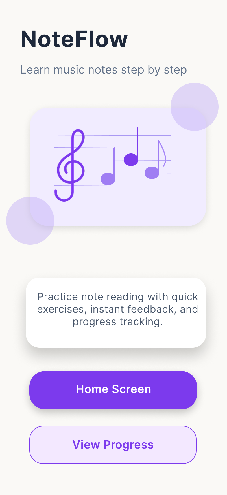

# NoteFlow – UX/UI Mobile App Case Study

NoteFlow is a mobile UX/UI case study for a beginner-friendly music note-reading practice app.

The app is designed for beginner music students who want to improve note recognition through short exercises, instant feedback, weak note review, and progress tracking.

This project was created as a UX/UI portfolio project using Figma and GitHub documentation.

---

## Cover



---

## Project Overview

NoteFlow helps beginner music students practice reading notes on the music staff in a simple and motivating way.

The main idea is to make note-reading practice feel:

* Short
* Clear
* Beginner-friendly
* Less stressful
* Motivating
* Easy to use on mobile

The project includes UX process documentation, high-fidelity screens, wireframes, design tokens, reusable components, prototype flow, accessibility notes, AI-assisted design documentation, and developer handoff notes.

---

## Problem

Beginner music students often struggle to recognize notes quickly on the staff.

Traditional note-reading practice can feel repetitive, confusing, or stressful, especially for students who are just starting music theory or piano.

Beginner users may also not know which notes they should review or how much progress they are making.

---

## Target User

The target user is a beginner music student.

This user may be:

* A beginner piano student
* A student learning basic music theory
* Someone who recognizes notes slowly
* Someone who prefers short daily practice
* Someone who needs clear feedback and visible progress

Example proto-persona:

**Sara, 17**
A beginner piano student who wants to recognize notes faster but sometimes confuses notes on the staff. She needs short, simple, and motivating practice.

---

## Product Goal

The goal of NoteFlow is to help beginner music students improve note recognition through:

* Short note-reading exercises
* Multiple-choice questions
* Instant feedback
* Weak note review
* Practice results
* Progress tracking
* A calm and supportive mobile interface

---

## Main User Flow

The main user flow is:

```text
Welcome → Home → Practice → Result → Progress
```

Flow explanation:

1. The user opens the app.
2. The user sees the Welcome Screen.
3. The user enters the Home Screen.
4. The user starts a short practice session.
5. The user answers note-reading questions.
6. The user sees the result and accuracy.
7. The user reviews weak notes or checks progress.

---

## Screens

The project includes five main mobile screens:

### 1. Welcome Screen

Introduces the app and gives the user a clear starting point.


### 2. Home Screen

Shows today’s practice, quick actions, and a progress preview.


### 3. Practice Screen

Shows a note-reading question with multiple-choice answers.


### 4. Result Screen

Shows score, accuracy, weak notes, and next actions.


### 5. Progress Screen

Shows practice streak, average accuracy, weekly chart, weak notes, and recommended practice.


---

## UX Process

The UX process was documented in separate files inside the `docs` folder.

### UX Foundations

Defines the user, problem, user needs, product goal, and main UX goals.

[Read UX Foundations](docs/01-ux-foundations.md)

### Design Thinking

Explains the process from empathy and problem definition to ideation, prototype, and future testing.

[Read Design Thinking](docs/02-design-thinking.md)

### UX Research

Includes proto-research, assumptions, research questions, insights, and research limitations.

[Read UX Research](docs/03-ux-research.md)

### Affinity Diagram

Organizes possible user needs into groups such as note recognition problems, short practice, feedback, and motivation.

[Read Affinity Diagram](docs/04-affinity-diagram.md)

### Proto-Persona

Defines the main target user and how their goals and pain points shaped the design.

[Read Persona](docs/05-persona.md)

### User Flow

Shows the main path the user takes through the app.

[Read User Flow](docs/06-user-flow.md)

### Information Architecture

Explains how the app content, screens, and navigation are organized.

[Read Information Architecture](docs/07-information-architecture.md)

### Wireframes

Shows the low-fidelity structure of the main screens.

[Read Wireframes](docs/08-wireframes.md)

---

## Wireframes

The wireframes were created to focus on layout, content priority, and user flow before final UI design.


---

## Design System

A small design system was created to keep the interface consistent and easier to hand off to frontend development.

The design system includes:

* Design tokens
* Colors
* Typography
* Spacing
* Radius
* Shadows
* Buttons
* Cards
* Answer options
* Bottom navigation
* Progress ring
* Progress bar
* Weak note chips

[Read Design System](docs/09-design-system.md)

### Design Tokens


### Components


---

## Main Components

The main reusable components include:

* Button
* Card
* Answer Option
* Bottom Navigation
* Progress Bar
* Progress Ring
* Weak Note Chip

Some components include states such as:

### Button

* Default
* Secondary
* Disabled

### Answer Option

* Default
* Selected
* Correct
* Wrong

### Bottom Navigation

* Default
* Active

---

## Prototype

The prototype was created in Figma to show the main user journey.

Main prototype flow:

```text
Welcome → Home → Practice → Result → Progress
```

The prototype helps demonstrate how the user moves from starting practice to answering questions, seeing the result, and checking progress.

[Read Prototype Documentation](docs/10-prototype.md)


---

## Accessibility and Usability

The design considers basic accessibility and usability principles.

Key considerations:

* Clear visual hierarchy
* Readable text
* Large touch-friendly buttons
* Simple navigation
* Short practice flow
* Clear correct/wrong feedback
* Feedback should not rely only on color
* Progress should be shown visually and numerically

[Read Accessibility and Usability](docs/11-accessibility-usability.md)

---

## AI-Assisted Design

AI tools were used as a support tool during the design process.

AI helped with:

* Ideation
* UX research planning
* Persona structure
* User flow review
* UX writing
* Accessibility review
* Design system organization
* Documentation structure
* Developer handoff planning

AI was used as a design assistant, not as a replacement for design decisions. The final Figma screens, visual style, components, user flow, and documentation were reviewed and adjusted manually.

[Read AI-Assisted Design](docs/12-ai-assisted-design.md)

---

## Developer Handoff

The developer handoff document explains how the design could be implemented by frontend developers.

It includes:

* Screens
* Components
* Component states
* Design tokens
* Dynamic behavior
* Assets
* Accessibility notes
* Future backend considerations

[Read Developer Handoff](docs/13-developer-handoff.md)

---

## Tools Used

* Figma
* GitHub
* AI-assisted design tools for ideation, UX writing, documentation, and review

---

## What I Learned

Through this project, I practiced:

* UX Foundations
* Design Thinking
* UX Research Planning
* Affinity Diagram
* Persona
* User Flow
* Information Architecture
* Wireframing
* UI Design Principles
* Design Tokens
* Figma Components
* Prototyping
* Accessibility and Usability Thinking
* AI-Assisted Product Design
* Developer Handoff Documentation

---

## Future Improvements

If I had more time, I would:

* Conduct real user interviews with beginner music students
* Test the prototype with 2–3 users
* Improve accessibility with contrast checks
* Add more answer states and feedback variations
* Add more realistic note-reading questions
* Create a frontend version using React or React Native
* Add backend support for saved progress and weak notes
* Add analytics events to understand user behavior

---

## Figma Link

The Figma file and prototype link are available here:

[View Figma Link](figma-link.txt)

---

## Project Status

This is a UX/UI portfolio case study and prototype.

The current version focuses on product design, UX process, UI structure, design system basics, and documentation. It is not a fully developed app yet.
