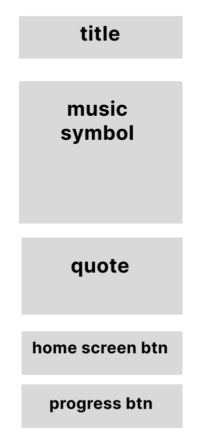
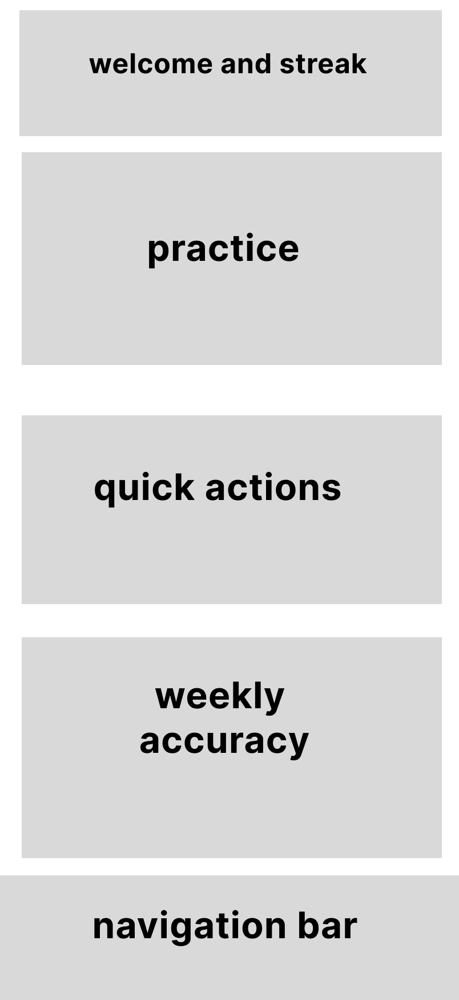
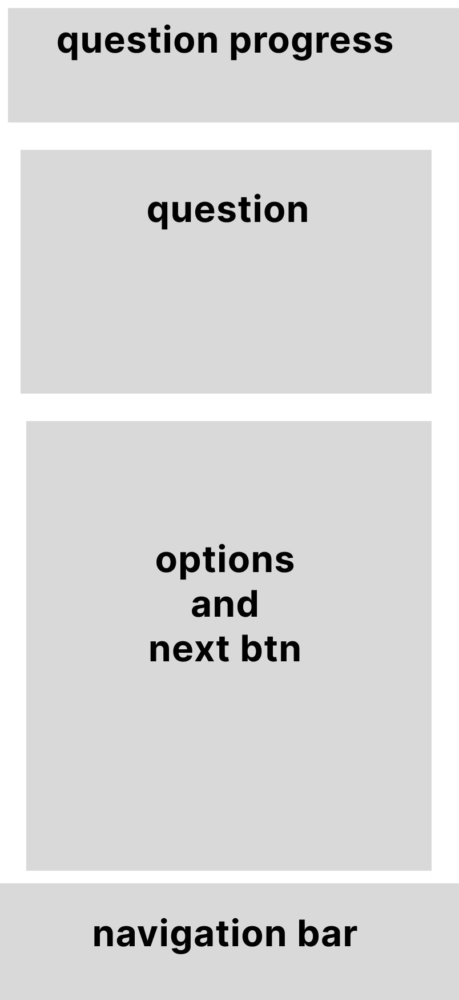
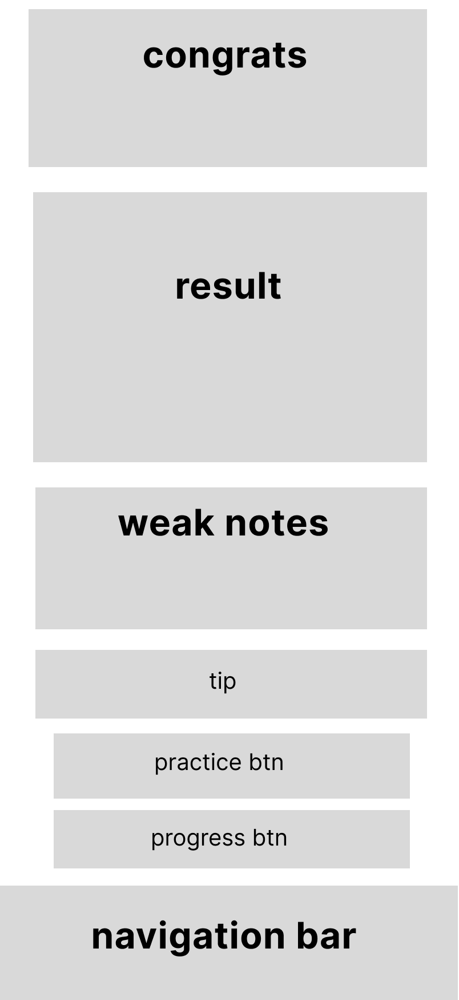
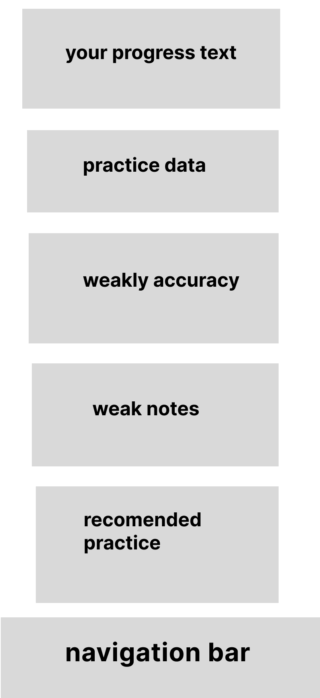

# Wireframes

## Overview

Wireframing is the process of creating a simple low-fidelity structure before designing the final high-fidelity UI.

The goal of wireframing is to focus on layout, content priority, navigation, and user flow before working on colors, shadows, icons, and detailed visual design.

For NoteFlow, the wireframes were used to plan the structure of the main mobile screens before creating the final UI in Figma.

---

## UX Sources Used for Wireframes

The wireframes were shaped by previous UX steps:

* UX Foundations
* UX Research
* Affinity Diagram
* Proto-Persona
* User Flow
* Information Architecture

These steps showed that beginner music students need:

* A clear starting point
* Short and simple practice
* One focused task at a time
* Clear feedback after practice
* Weak note review
* Visible progress
* Simple mobile navigation

Because of these findings, the wireframes focus on clarity, simplicity, and a beginner-friendly learning flow.

---

## Wireframe Goals

The main goals of the wireframes were:

1. Define the structure of each screen
2. Place the most important content first
3. Keep the practice flow simple
4. Reduce cognitive load for beginner users
5. Prepare the layout before high-fidelity UI design
6. Make sure each screen supports the user’s main goal

---

## Research-Based Wireframe Decisions

| UX Finding                                       | Source                        | Wireframe Decision                                                 |
| ------------------------------------------------ | ----------------------------- | ------------------------------------------------------------------ |
| Beginner users need a clear starting point.      | UX Foundations, Persona       | Place the main action clearly on Welcome and Home.                 |
| Users prefer short and simple practice.          | UX Research, Affinity Diagram | Make Today’s Practice the main section on Home.                    |
| Users may feel confused by too much information. | Persona, UX Foundations       | Keep Practice focused on one question at a time.                   |
| Users need clear feedback after practice.        | Affinity Diagram              | Add a separate Result Screen with score, accuracy, and weak notes. |
| Users want to know what to review.               | UX Research, Affinity Diagram | Add Weak Notes to Result and Progress.                             |
| Progress can motivate users.                     | Persona, Affinity Diagram     | Add a dedicated Progress Screen with stats and weekly chart.       |
| Mobile users need easy navigation.               | Mobile Design, UX Foundations | Use a simple Bottom Navigation for main screens.                   |

---

# Wireframe Screens

## 1. Welcome Screen Wireframe

### Purpose

The Welcome Screen introduces the app and gives the user a simple entry point.

### UX Reasoning

Based on UX Foundations, the user should quickly understand what the app does and what action to take first.

Because of this, the wireframe includes:

* App name
* Short value statement
* Music-related visual area
* Start Practice action
* View Progress action

---

## 2. Home Screen Wireframe

### Purpose

The Home Screen acts as the main dashboard and helps the user quickly start practice.

### UX Reasoning

Based on UX Research and the Affinity Diagram, beginner users need short and simple practice.

Because of this, Today’s Practice is placed as the main section on the Home Screen.

The Home Screen also includes Quick Actions and Progress Preview because the persona needs quick access to practice tools and motivation through progress.

### Content Priority

1. Greeting
2. Today’s Practice
3. Quick Actions
4. Progress Preview
5. Bottom Navigation

---

## 3. Practice Screen Wireframe

### Purpose

The Practice Screen helps the user focus on answering one note-reading question at a time.

### UX Reasoning

Based on the Proto-Persona, beginner users may feel confused or stressed if the screen shows too much information.

Because of this, the wireframe keeps the Practice Screen focused on:

* One question
* One music staff area
* Clear answer options
* One next action

Based on the Affinity Diagram, users also need clear feedback, so the answer options are planned as interactive states in the final UI.

### Content Priority

1. Question progress
2. Main question
3. Music staff and note
4. Answer options
5. Next button

---

## 4. Result Screen Wireframe

### Purpose

The Result Screen gives the user clear feedback after completing practice.

### UX Reasoning

Based on the Affinity Diagram, users need immediate and supportive feedback after practice.

Because of this, the wireframe includes:

* Encouraging message
* Score
* Accuracy
* Weak notes
* Practice Again action
* View Progress action

Based on the Persona, the feedback should feel encouraging rather than stressful.

### Content Priority

1. Encouraging message
2. Accuracy and score
3. Weak notes
4. Next actions

---

## 5. Progress Screen Wireframe

### Purpose

The Progress Screen helps the user understand improvement over time.

### UX Reasoning

Based on the Persona and Affinity Diagram, seeing progress can motivate beginner users to continue practicing.

Because of this, Progress is designed as a dedicated screen.

The screen includes stats, weekly accuracy, weak notes, and recommended practice because users need both motivation and clear next steps.

### Content Priority

1. Main progress stats
2. Weekly accuracy
3. Weak notes
4. Recommended practice
5. Bottom Navigation

---

## Wireframe to UI Decisions

| Wireframe Decision                         | Final UI Impact                                                          |
| ------------------------------------------ | ------------------------------------------------------------------------ |
| Today’s Practice placed at the top of Home | The final Home Screen highlights the practice card as the main action.   |
| One question at a time in Practice         | The final Practice Screen stays focused and uncluttered.                 |
| Result comes after Practice                | The final Result Screen gives immediate feedback after completion.       |
| Weak Notes included in Result and Progress | The final UI helps users understand what to review.                      |
| Progress has a dedicated screen            | The final UI supports motivation through stats and charts.               |
| Bottom Navigation kept simple              | The final UI uses Home, Practice, and Progress as main navigation items. |

---

## Gestalt Principles Considered

The wireframes also consider basic Gestalt principles.

### Proximity

Related elements are placed close together.

Example:

* Question, music staff, and answer options are grouped on the Practice Screen.
* Weak notes are grouped together on Result and Progress.

### Similarity

Similar elements follow similar structure.

Example:

* Answer options have consistent size and placement.
* Cards on the Home Screen follow a consistent layout.

### Common Region

Related content is placed inside the same section or card.

Example:

* Today’s Practice content is grouped in one main card.
* Progress stats are grouped together.

### Visual Hierarchy

Important actions are placed clearly and given priority.

Example:

* Start Practice is the main action on Home.
* Accuracy is visually central on Result.

---

## Summary

The wireframes helped translate UX findings into screen structure.

Instead of starting with visual details, the wireframes focused on:

* User needs
* Content priority
* Simple navigation
* Clear feedback
* Mobile layout
* Beginner-friendly flow

This made the final UI design more structured and easier to explain as a UX/UI case study.
